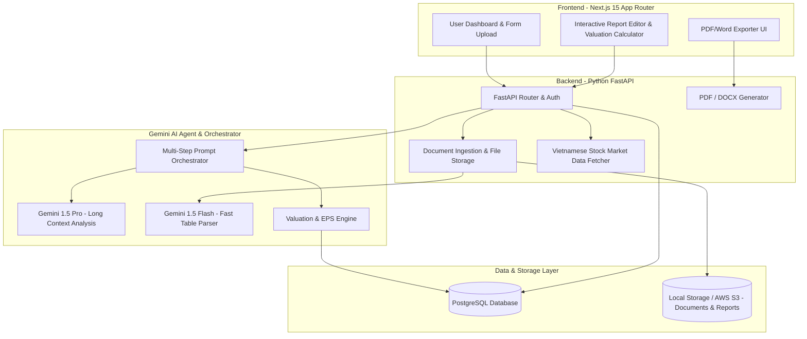
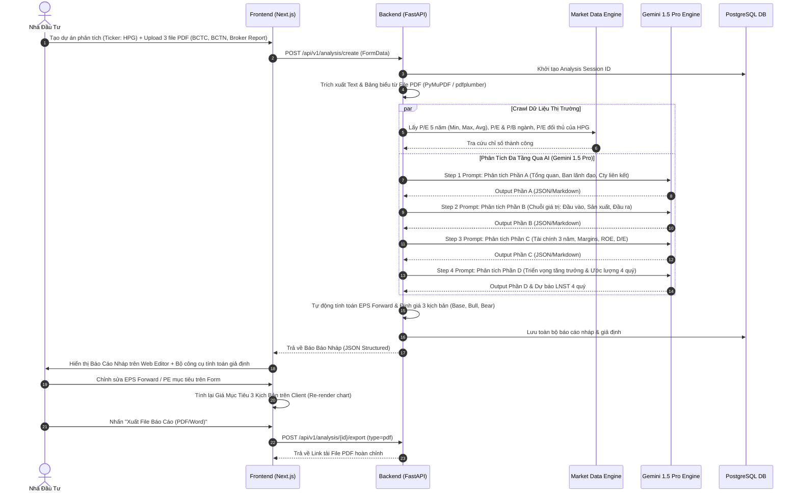

# Technical Architecture Document (TECH_ARCHITECTURE.md)
## Hệ Thống Phân Tích Cơ Hội Đầu Tư Chứng Khoán Tự Động (Stock Analysis AI Platform)

---

## 1. Kiến Trúc Tổng Quan (System Architecture Overview)

Hệ thống được thiết kế theo kiến trúc **Decoupled Client-Server & Micro-services/Async Pipeline**, cho phép xử lý song song các tác vụ trích xuất tài liệu nặng và gọi AI LLM mà không làm nghẽn luồng tương tác người dùng.



---

## 2. Lựa Chọn Công Nghệ (Technology Stack)

| Tầng (Layer) | Công nghệ lựa chọn | Lý do chọn lựa |
| :--- | :--- | :--- |
| **Frontend Framework** | Next.js 15 (React 19 + TypeScript) | Rendering hiệu năng cao, App Router tối ưu SEO/Web Performance, tích hợp SSR & Client State mượt mà. |
| **Styling & UI Kit** | TailwindCSS + Shadcn/ui | Giao diện chuẩn SaaS hiện đại, tối giản, hỗ trợ Dark/Light mode chuẩn tài chính. |
| **State & Charts** | Zustand + Recharts | Quản lý state nháp báo cáo & vẽ biểu đồ định giá 3 kịch bản thời gian thực. |
| **Backend Framework** | Python FastAPI (AsyncIO) | Xử lý tài liệu PDF/Excel vượt trội, hệ sinh thái AI/Data phong phú (PyPDF, pandas, Gemini SDK). |
| **Database & ORM** | PostgreSQL + SQLAlchemy / Alembic | Quản lý dữ liệu quan hệ chặt chẽ (mã cổ phiếu, báo cáo, giả định, lịch sử định giá). |
| **AI Engine** | Google Gemini 1.5 Pro & Flash | **Gemini 1.5 Pro** có Context Window 1M-2M tokens (đọc trọn gói BCTN 100 trang mà không bị trôi ngữ cảnh). **Flash** để parse bảng biểu tài chính nhanh. |
| **PDF/Doc Parser** | `pdfplumber` + `PyMuPDF (fitz)` + `pandas` | Trích xuất chính xác bảng BCTC, thuyết minh BCTC và văn bản tiếng Việt từ PDF. |
| **Export Service** | `WeasyPrint` / `python-docx` | Xuất file PDF chuẩn in ấn CSS & file Word editable. |

---

## 3. Luồng Xử Lý Dữ Liệu & AI Pipeline (Data & AI Workflow)



---

## 4. Thiết Kế Cơ Sở Dữ Liệu (Database Schema)

```sql
-- Bảng Danh Mục Mã Cổ Phiếu
CREATE TABLE stocks (
    ticker VARCHAR(10) PRIMARY KEY,
    company_name VARCHAR(255) NOT NULL,
    industry VARCHAR(100),
    current_price DECIMAL(12, 2),
    pe_industry DECIMAL(8, 2),
    pb_industry DECIMAL(8, 2),
    pe_5yr_min DECIMAL(8, 2),
    pe_5yr_max DECIMAL(8, 2),
    pe_5yr_avg DECIMAL(8, 2),
    updated_at TIMESTAMP DEFAULT CURRENT_TIMESTAMP
);

-- Bảng Phiên Phân Tích (Analysis Session)
CREATE TABLE analysis_sessions (
    id UUID PRIMARY KEY DEFAULT gen_random_uuid(),
    ticker VARCHAR(10) REFERENCES stocks(ticker),
    title VARCHAR(255) NOT NULL,
    status VARCHAR(20) DEFAULT 'PROCESSING', -- PENDING, PROCESSING, COMPLETED, FAILED
    created_at TIMESTAMP DEFAULT CURRENT_TIMESTAMP,
    updated_at TIMESTAMP DEFAULT CURRENT_TIMESTAMP
);

-- Bảng Tài Liệu Upload (Uploaded Documents)
CREATE TABLE session_documents (
    id UUID PRIMARY KEY DEFAULT gen_random_uuid(),
    session_id UUID REFERENCES analysis_sessions(id) ON DELETE CASCADE,
    file_name VARCHAR(255) NOT NULL,
    file_type VARCHAR(50), -- BCTC, BCTN, BROKER_REPORT
    file_path VARCHAR(512) NOT NULL,
    extracted_text_path VARCHAR(512),
    created_at TIMESTAMP DEFAULT CURRENT_TIMESTAMP
);

-- Bảng Nội Dung Báo Cáo Phân Tích (Analysis Report Details)
CREATE TABLE analysis_reports (
    id UUID PRIMARY KEY DEFAULT gen_random_uuid(),
    session_id UUID REFERENCES analysis_sessions(id) ON DELETE CASCADE,
    section_a_overview JSONB,      -- Lịch sử, Cổ đông, Ban lãnh đạo, Công ty liên kết
    section_b_value_chain JSONB,   -- Mô hình KD, Đầu vào, Quy trình sản xuất, Đầu ra
    section_c_financials JSONB,    -- Doanh thu 3 năm, Tỷ suất LN, Sức khỏe tài chính D/E
    section_d_outlook JSONB,       -- Yếu tố tăng trưởng, Dự báo 4 quý tiếp theo
    created_at TIMESTAMP DEFAULT CURRENT_TIMESTAMP,
    updated_at TIMESTAMP DEFAULT CURRENT_TIMESTAMP
);

-- Bảng Giả Định & Kết Quả Định Giá (Valuation Assumptions & Results)
CREATE TABLE valuation_models (
    id UUID PRIMARY KEY DEFAULT gen_random_uuid(),
    session_id UUID REFERENCES analysis_sessions(id) ON DELETE CASCADE,
    forecast_net_profit_q1 DECIMAL(15, 2),
    forecast_net_profit_q2 DECIMAL(15, 2),
    forecast_net_profit_q3 DECIMAL(15, 2),
    forecast_net_profit_q4 DECIMAL(15, 2),
    forecast_eps_forward DECIMAL(10, 2),
    pe_base DECIMAL(8, 2),
    pe_bull DECIMAL(8, 2),
    pe_bear DECIMAL(8, 2),
    target_price_base DECIMAL(12, 2),
    target_price_bull DECIMAL(12, 2),
    target_price_bear DECIMAL(12, 2),
    notes TEXT,
    updated_at TIMESTAMP DEFAULT CURRENT_TIMESTAMP
);
```

---

## 5. Thiết Kế Prompt Engineering cho Gemini 1.5 Pro

Để báo cáo đạt chất lượng chuyên nghiệp và tuân thủ `analysis-guide.md`, hệ thống chia Prompt thành các bước chuyên biệt (Chain of Prompts):

1. **System Prompt Core**:
   > "Bạn là Chuyên gia Phân tích Đầu tư Chứng khoán cấp cao tại Việt Nam. Nhiệm vụ của bạn là dựa trên tập tài liệu được cung cấp (BCTC, BCTN, Báo cáo CTCK) và dữ liệu thị trường để lập báo cáo phân tích theo đúng cấu trúc chuẩn. Mọi số liệu phải chính xác, ghi rõ nguồn trích dẫn từ tài liệu. Không tự bịa đặt số liệu tài chính."

2. **Prompt Step 1 (Mô hình KD & Chuỗi Giá Trị)**:
   > "Phân tích chi tiết Chuỗi giá trị của công ty {ticker}:
   > - Đầu vào: Yếu tố chi phí chính, nhà cung cấp, rủi ro biến động giá.
   > - Sản xuất: Năng lực, công suất nhà máy hiện tại & kế hoạch mở rộng.
   > - Đầu ra: Cơ cấu doanh thu theo sản phẩm, yếu tố tác động sản lượng & giá bán."

3. **Prompt Step 2 (Dự báo & Định giá 3 Kịch bản)**:
   > "Dựa trên kết quả kinh doanh quá khứ và kế hoạch mới, hãy đưa ra dự báo Doanh thu & LNST cho 4 quý tiếp theo. Giải thích rõ luận điểm tăng trưởng cho sản lượng và giá bán. Trả về format JSON chứa thông số dự báo LNST 4 quý để hệ thống tính toán EPS forward."

---

## 6. Chiến Lược Bảo Mật & Tối Ưu

- **Xử lý file song song (Async Processing)**: Sử dụng FastAPI Background Tasks / CeleryWorker giúp người dùng không bị treo màn hình khi upload tài liệu lớn.
- **Tối ưu Token AI**: Sử dụng Gemini 1.5 Flash cho các tác vụ trích xuất sơ bộ và Gemini 1.5 Pro cho tác vụ tổng hợp lập luận chuyên sâu.
- **An Toàn Dữ Liệu**: Mã hóa file PDF được upload, kiểm tra định dạng an toàn tránh RCE/Malware injection.
