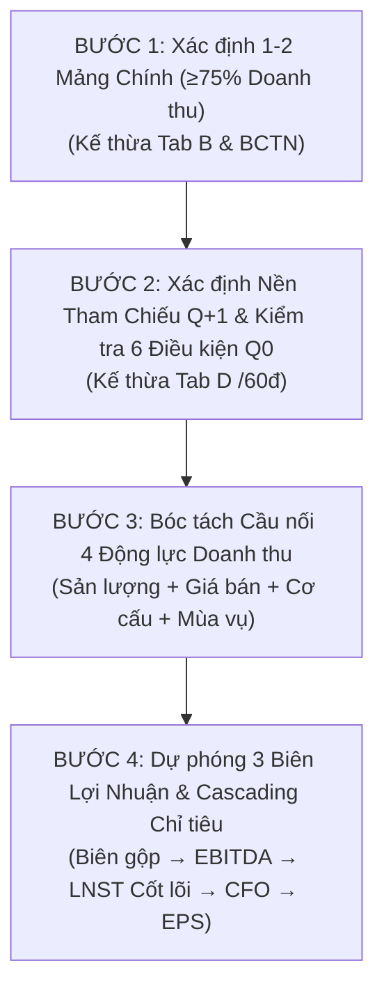

# VALUEX – CẦU NỐI DỰ PHÓNG DOANH THU & LỢI NHUẬN (8 QUÝ)
> **Tài liệu đặc tả chuẩn hóa phương pháp luận dự phóng tài chính ValueX**  
> Dòng chảy logic bắt buộc:  
> **1–2 Mảng chính (≥75% DT) → Công suất/Sản lượng → Giá bán (ASP) → Cơ cấu/Nhu cầu → Doanh thu → 3 Biên lợi nhuận → LNST cốt lõi → CFO → EPS & Định giá**

---

## 1. NGUYÊN TẮC CỐT LÕI

1. **Không dự phóng theo cảm tính hoặc giả định tăng trưởng cào bằng:**
   - Tuyệt đối không áp đặt một tỷ lệ tăng trưởng cố định (ví dụ "mỗi năm tăng 10%") cho toàn bộ doanh nghiệp.
   - Mọi dự phóng phải bóc tách thành **4 động lực cụ thể**: Sản lượng/Công suất, Giá bán bình quân (ASP), Cơ cấu/Thị phần/Nhu cầu, và Mùa vụ/Khác.
2. **Quy tắc Pareto 80/20 – Tập trung vào 1–2 mảng kinh doanh chính (≥75% Doanh thu):**
   - Lấy dữ liệu cơ cấu doanh thu từ **Báo cáo thường niên (BCTN)** và **Tab B Chuỗi giá trị (Phần 3: Đầu ra & Cơ cấu sản phẩm `revenueBreakdown`)**.
   - Bóc tách 4 động lực vi mô trên 1–2 mảng cốt lõi này; các mảng thứ yếu (<25%) được giả định tăng trưởng ổn định theo tốc độ trung bình ngành/quá khứ.
3. **Kế thừa dữ liệu đã thẩm định từ Tab D (Chất lượng tăng trưởng) & Reference Documents:**
   - Giả định Sản lượng: Kế thừa từ Tiêu chí **B2** (Công suất mở rộng) & **D1** (Dư địa công suất) + Trang tính Phân tích Công suất.
   - Giả định Giá bán (ASP): Kế thừa từ Tiêu chí **C3** (Năng lực định giá / Pricing Power) + Báo cáo ngành/CTCK.
   - Giả định Nhu cầu & Cơ cấu: Kế thừa từ Tiêu chí **B1** (Backlog đơn hàng) & **B3** (Chỉ báo cầu/Thị phần).
   - Nền Lợi nhuận Q0: Kế thừa từ **Cầu Nối LNST Cốt Lõi** (đã loại bỏ 100% doanh thu tài chính bất thường, lãi bán tài sản, one-off).
4. **Dự phóng 3 Biên lợi nhuận (Biên Gộp, Biên EBITDA, Biên LNST):**
   - Đi từ **Mức nền trung bình 4 quý lịch sử** (từ Vietcap IQ API) $\pm$ **Điều chỉnh triển vọng thực tế** (chênh lệch ASP vs Giá vốn COGS, Đòn bẩy định phí SG&A, Chi phí khấu hao và lãi vay mới khi COD).
5. **Định dạng trực quan:**
   - Trình bày dạng **Bảng tính Ma trận 8 Quý (4 Quá khứ + 4 Dự phóng)** tinh gọn, minh bạch, không dùng biểu đồ Waterfall chart rườm rà.

---

## 2. QUY TRÌNH 4 BƯỚC THỰC HIỆN DỰ PHÓNG



---

### BƯỚC 1: XÁC ĐỊNH 1–2 MẢNG KINH DOANH CHÍNH (≥75% DOANH THU)

* **Nguồn dữ liệu:** Thuyết minh bộ phận BCTC kiểm toán, Báo cáo thường niên (BCTN) năm gần nhất, và Tab B Chuỗi Giá Trị (`sectionB.revenueBreakdown`).
* **Tiêu chuẩn lựa chọn:**
  - Chọn 1 hoặc tối đa 2 mảng kinh doanh có đóng góp cộng dồn $\ge 75\%$ tổng doanh thu thuần.
  - *Ví dụ mẫu:*
    - **HPG:** Thép xây dựng (62%) + Thép cuộn cán nóng HRC (28%) = **90%**.
    - **FPT:** Xuất khẩu phần mềm (55%) + Dịch vụ Viễn thông (35%) = **90%**.
    - **MWG:** Chuỗi Điện Máy Xanh (48%) + Bách Hóa Xanh (28%) = **76%**.
    - **VNM:** Sữa nước (45%) + Sữa bột (25%) + Sữa chua (18%) = **88%**.
* **Công thức phân bổ tăng trưởng:**
  $$g_{\text{Tổng Doanh Thu}} = w_{\text{mảng 1}} \times g_{\text{mảng 1}} + w_{\text{mảng 2}} \times g_{\text{mảng 2}} + w_{\text{mảng khác}} \times g_{\text{mảng khác}}$$

---

### BƯỚC 2: XÁC ĐỊNH NỀN THAM CHIẾU DOANH THU CHO Q+1

Dựa trên **Điểm Chất lượng tăng trưởng (/60đ)** từ Tab D:

| Điểm Tăng Trưởng | Xếp Hạng | Chế Độ Dự Báo | Công Thức Nền Q+1 Gợi Ý |
| :---: | :---: | :---: | :--- |
| **$\ge 48.0$ / 60** | **A / A+** | **NÂNG NỀN** | Lấy $Q_0$ đã chuẩn hóa làm mặt bằng hoạt động mới. |
| **$36.0 - 47.9$ / 60** | **B / B+** | **PHA TRỘN** | $60\% \times Q_0 \text{ chuẩn hóa} + 40\% \times \text{Trung bình 3 quý gần nhất (Q-2 → Q0)}$. |
| **$< 36.0$ / 60** | **C / D** | **THẬN TRỌNG** | Lấy $\text{Trung bình 4 quý gần nhất (Q-3 → Q0)}$ đã bình thường hóa. |

#### 6 Điều Kiện Bắt Buộc Để Coi $Q_0$ Là "Nền Mới":
1. **Hoạt động kinh doanh cốt lõi:** Doanh thu và LNST tăng do kinh doanh thực chất, không do bán tài sản/khoản một lần.
2. **Độ chắc chắn đơn hàng:** Đơn hàng đã ký/công suất/nhu cầu thị trường được xác nhận duy trì ít nhất 2 quý tiếp theo.
3. **Tiến độ nhà máy mới:** Nếu có nhà máy mới, tỷ lệ vận hành kỹ thuật và khả năng thị trường hấp thụ phải phù hợp thực tế.
4. **Độ bền biên lợi nhuận:** Biên lợi nhuận quý gần nhất không phải là mức siêu đột biến do giá hàng hóa đỉnh chu kỳ.
5. **Chất lượng dòng tiền:** Vốn lưu động và dòng tiền hoạt động (CFO) không suy giảm bất thường (không đọng công nợ ảo).
6. **Không phụ thuộc nền thấp:** Tăng trưởng quý gần nhất không phải hoàn toàn nhờ cùng kỳ năm trước bị đình trệ/ngừng sản xuất.

> *Nếu vi phạm bất kỳ điều kiện nào trong 6 điều kiện trên $\implies$ Bắt buộc hạ chế độ dự báo về **PHA TRỘN** hoặc **THẬN TRỌNG**.*

---

### BƯỚC 3: BÓC TÁCH CẦU NỐI 4 ĐỘNG LỰC TĂNG GIẢM DOANH THU

Cầu nối tăng trưởng doanh thu so với quý trước ($QoQ$):
$$g_{\text{bridge}} = \Delta \text{Sản lượng/Công suất} + \Delta \text{Giá bán bình quân (ASP)} + \Delta \text{Cơ cấu/Thị phần/Nhu cầu} + \Delta \text{Mùa vụ/Yếu tố khác}$$

1. **Ảnh hưởng Sản lượng / Công suất (Volume / Capacity Impact):**
   - *Tài sản hiện hữu:* Tỷ lệ sử dụng công suất ($Util\%$) tăng nhờ tối ưu hóa vận hành.
   - *Dự án mở rộng:* Liên kết trực tiếp từ bảng Phân tích công suất:
     $$\text{Sản lượng tăng thêm} = \text{Công suất thiết kế mới} \times \min(\text{Tỷ lệ vận hành kỹ thuật}, \text{Khả năng thị trường hấp thụ})$$
   - *Căn cứ thực tế:* BCTN, Nghị quyết ĐHCĐ về tiến độ đưa nhà máy vào vận hành thương mại (COD).
2. **Ảnh hưởng Giá bán bình quân (Average Selling Price - ASP Impact):**
   - *Cơ sở:* Xu hướng giá hàng hóa thế giới (World Steel Price, Oil, Freight index), tỷ lệ hợp đồng chốt giá dài hạn, và năng lực chuyển giao chi phí sang khách hàng (Pricing Power - Tiêu chí C3 Tab D).
3. **Ảnh hưởng Cơ cấu / Thị phần / Nhu cầu (Mix & Demand Impact):**
   - *Cơ sở:* Dịch chuyển sang sản phẩm giá trị gia tăng cao hơn (High-margin Mix), tăng trưởng nhu cầu ngành và chiếm lĩnh thêm thị phần từ đối thủ (Tiêu chí B1, B3 Tab D).
4. **Ảnh hưởng Mùa vụ & Yếu tố khác (Seasonality / Others):**
   - *Cơ sở:* Chu kỳ mùa vụ theo quý lặp lại (Q1 nghỉ Tết làm giảm sản lượng xây dựng, Q4 cao điểm bán lẻ và bàn giao nghiệm thu công trình), hoặc lịch dừng máy bảo dưỡng định kỳ hàng năm.

---

### BƯỚC 4: DỰ PHÓNG 3 BIÊN LỢI NHUẬN & CASCADING CHỈ TIÊU

Dự phóng 3 biên lợi nhuận dựa trên **Mức nền trung bình 4 quý gần nhất $\pm$ Điều chỉnh triển vọng**:

```
1. BIÊN LỢI NHUẬN GỘP (GM%):
   GM% dự phóng = GM% Trung bình 4Q ± Δ(ASP vs COGS) + Hiệu quả quy mô
   → Lợi nhuận gộp = Doanh thu chuẩn hóa × GM%

2. BIÊN EBITDA (EBITDA%):
   EBITDA% dự phóng = EBITDA% Trung bình 4Q + ΔĐòn bẩy định phí SG&A (Operating Leverage)
   → EBITDA = Doanh thu chuẩn hóa × EBITDA%

3. BIÊN LNST CỐT LÕI (NetMargin%):
   NetMargin% dự phóng = NetMargin% Trung bình 4Q - Chi phí tài chính/Lãi vay mới - Khấu hao mới
   → LNST Cốt lõi = Doanh thu chuẩn hóa × NetMargin%

4. DÒNG TIỀN HOẠT ĐỘNG (CFO):
   CFO = LNST Cốt lõi × (CFO / LNST%)  [Chuẩn mực: 80% – 100%]

5. EPS CỐT LÕI & ĐỊNH GIÁ FORWARD:
   EPS Cốt lõi = (LNST Cốt lõi × 10^9) / Số cổ phiếu pha loãng
   P/E Forward = Giá hiện tại / TTM EPS 4 quý tới
```

---

## 3. MA TRẬN DỮ LIỆU 8 QUÝ (4 QUÁ KHỨ + 4 DỰ PHÓNG)

| STT | Chỉ tiêu tài chính | ĐVT | Q-3 | Q-2 | Q-1 | Q0 | Q+1 (F) | Q+2 (F) | Q+3 (F) | Q+4 (F) | TTM 4Q Tới | Tăng trưởng YoY |
| :---: | :--- | :---: | :---: | :---: | :---: | :---: | :---: | :---: | :---: | :---: | :---: | :---: |
| **I** | **DOANH THU & CẦU NỐI** | | | | | | | | | | | |
| 1 | Doanh thu thuần | tỷ | Thực tế | Thực tế | Thực tế | Thực tế | Dự phóng | Dự phóng | Dự phóng | Dự phóng | Tổng 4Q Fwd | YoY % |
| 2 | Khoản bất thường loại trừ | tỷ | - | - | - | - | 0 | 0 | 0 | 0 | - | - |
| 3 | Doanh thu chuẩn hóa | tỷ | Thực tế | Thực tế | Thực tế | Thực tế | Dự phóng | Dự phóng | Dự phóng | Dự phóng | Tổng 4Q Fwd | YoY % |
| 4 | Tăng trưởng Doanh thu QoQ | % | - | - | - | - | g_bridge | g_bridge | g_bridge | g_bridge | - | - |
| 4.1 | • Ảnh hưởng Sản lượng/Công suất | % | - | - | - | - | +X.X% | +X.X% | +X.X% | +X.X% | - | - |
| 4.2 | • Ảnh hưởng Giá bán bình quân (ASP) | % | - | - | - | - | ±X.X% | ±X.X% | ±X.X% | ±X.X% | - | - |
| 4.3 | • Ảnh hưởng Cơ cấu/Thị phần/Nhu cầu | % | - | - | - | - | +X.X% | +X.X% | +X.X% | +X.X% | - | - |
| 4.4 | • Ảnh hưởng Mùa vụ & Yếu tố khác | % | - | - | - | - | ±X.X% | ±X.X% | ±X.X% | ±X.X% | - | - |
| **II** | **3 BIÊN LỢI NHUẬN** | | | | | | | | | | | |
| 5 | Biên Lợi Nhuận Gộp | % | Thực tế | Thực tế | Thực tế | Thực tế | Dự phóng | Dự phóng | Dự phóng | Dự phóng | TB 4Q Fwd | Chênh lệch % |
| 6 | Biên EBITDA | % | Thực tế | Thực tế | Thực tế | Thực tế | Dự phóng | Dự phóng | Dự phóng | Dự phóng | TB 4Q Fwd | Chênh lệch % |
| 7 | Biên LNST Cốt Lõi | % | Thực tế | Thực tế | Thực tế | Thực tế | Dự phóng | Dự phóng | Dự phóng | Dự phóng | TB 4Q Fwd | Chênh lệch % |
| **III**| **LỢI NHUẬN & DÒNG TIỀN** | | | | | | | | | | | |
| 8 | Lợi nhuận gộp | tỷ | Thực tế | Thực tế | Thực tế | Thực tế | Tính toán | Tính toán | Tính toán | Tính toán | Tổng 4Q Fwd | YoY % |
| 9 | EBITDA | tỷ | Thực tế | Thực tế | Thực tế | Thực tế | Tính toán | Tính toán | Tính toán | Tính toán | Tổng 4Q Fwd | YoY % |
| 10 | LNST Cốt Lõi | tỷ | Thực tế | Thực tế | Thực tế | Thực tế | Tính toán | Tính toán | Tính toán | Tính toán | Tổng 4Q Fwd | YoY % |
| 11 | Dòng tiền HĐKD (CFO) | tỷ | Thực tế | Thực tế | Thực tế | Thực tế | Tính toán | Tính toán | Tính toán | Tính toán | Tổng 4Q Fwd | YoY % |
| 12 | CFO / LNST Cốt lõi | % | Thực tế | Thực tế | Thực tế | Thực tế | Dự phóng | Dự phóng | Dự phóng | Dự phóng | TB 4Q Fwd | - |
| **IV** | **HỆ SỐ CỔ PHẦN & ĐỊNH GIÁ**| | | | | | | | | | | |
| 13 | Số cổ phiếu bình quân pha loãng | tr cp | Thực tế | Thực tế | Thực tế | Thực tế | Cập nhật | Cập nhật | Cập nhật | Cập nhật | Hiện tại | - |
| 14 | EPS Cốt Lõi | đ/cp | Thực tế | Thực tế | Thực tế | Thực tế | Tính toán | Tính toán | Tính toán | Tính toán | TTM EPS Fwd | YoY % |
| 15 | BVPS (Giá trị sổ sách/CP) | đ/cp | Thực tế | Thực tế | Thực tế | Thực tế | Tính toán | Tính toán | Tính toán | Tính toán | BVPS Q+4 | - |
| 16 | P/E Trailing / Forward | lần | Trailing | Trailing | Trailing | Trailing | Forward | Forward | Forward | Forward | P/E Forward | - |
| 17 | P/B Trailing / Forward | lần | Trailing | Trailing | Trailing | Trailing | Forward | Forward | Forward | Forward | P/B Forward | - |
| 18 | EV/EBITDA Trailing / Forward | lần | Trailing | Trailing | Trailing | Trailing | Forward | Forward | Forward | Forward | EV/EBITDA Fwd| - |

---

## 4. BỘ KIỂM TRA TÍNH NHẤT QUÁN & KHẢ THI (CONSISTENCY GATES)

Trước khi chuyển dữ liệu sang Tab Định Giá, hệ thống tự động chạy 4 cổng kiểm tra:
1. **Điểm Tăng Trưởng vs LNST Forward:**  
   Nếu LNST Forward tăng trưởng $> 25\%$ nhưng Điểm Chất lượng tăng trưởng ở Tab D $< 36$ điểm (Hạng C/D) $\implies$ **Cảnh báo mâu thuẫn dữ liệu (Inconsistency Alert)**.
2. **Xác nhận Nền Q0:**  
   Nếu chọn chế độ **NÂNG NỀN** nhưng có điều kiện trong 6 điều kiện chưa đạt $\implies$ Bắt buộc hiển thị khuyến nghị hạ về Pha Trộn.
3. **Dung sai Biên Lợi Nhuận:**  
   Nếu Biên gộp dự phóng chênh lệch quá $\pm 3.0\%$ so với mức trung bình 4 quý lịch sử mà không có giải trình về tăng giá bán (ASP) hoặc giá vốn giảm $\implies$ Yêu cầu rà soát lại.
4. **Tỷ lệ chuyển đổi dòng tiền CFO/LNST:**  
   Tỷ lệ $CFO / LNST$ cả năm tới phải duy trì $\ge 80\%$. Nếu dưới $70\%$ trong 2 quý liên tiếp $\implies$ Cảnh báo rủi ro ứ đọng vốn lưu động hoặc doanh thu ảo.
